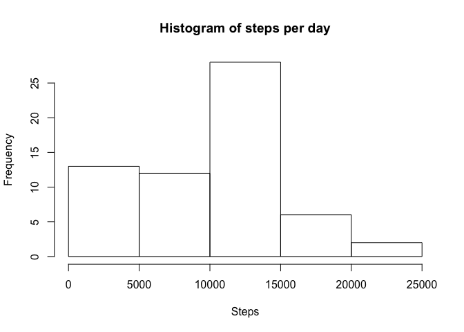
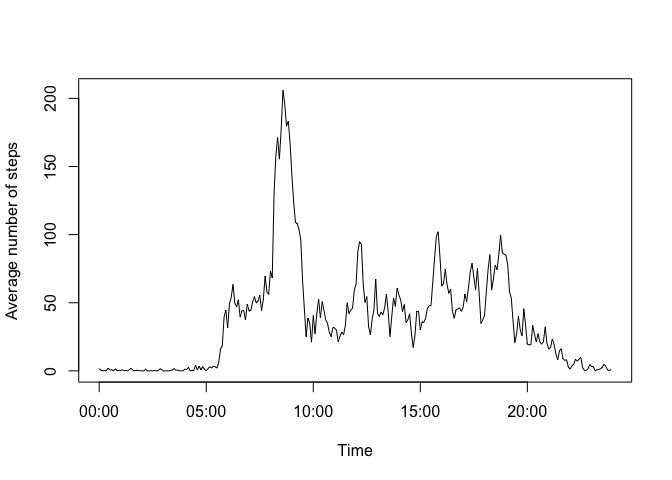
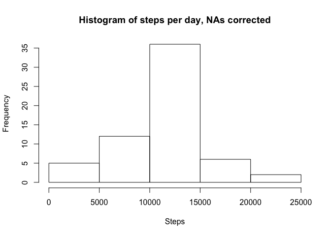
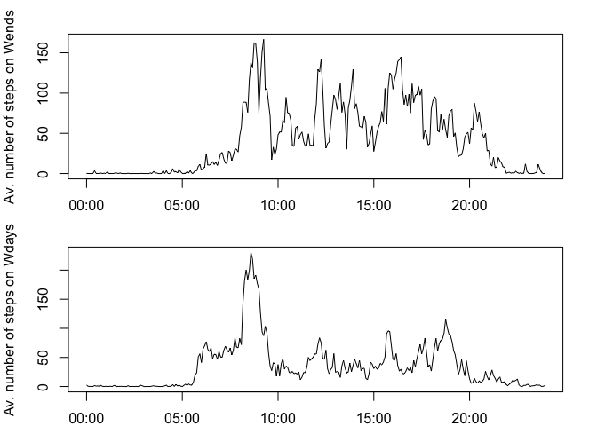

# Reproducible Research: Peer Assessment 1


## Loading and preprocessing the data

The data can be read by simply doing: 


```r
raw_data <- read.csv("activity.csv",sep=",")
```

Then we save the NAs in another variable (in case we need the NAs later): 


```r
NAs <- raw_data[,1]
```

and note there are 61 diferent days: 


```r
unique_days <- unique(raw_data[,2])
number_of_days <- length(unique_days)
```

## What is mean total number of steps taken per day?

The mean can be calculated using the following code: 


```r
steps_per_day <- aggregate(raw_data$steps, by=list(raw_data$date), sum, na.rm=TRUE)
```

the histogram of the total number of steps taken each day is 

```r
hist(steps_per_day[,2], main="Histogram of steps per day", xlab="Steps", breaks=5)
```

 

also the mean and the median of the total number of steps per day are computed, respectively, by doing: 


```r
mean(steps_per_day[,2])
```

```
## [1] 9354.23
```

```r
median(steps_per_day[,2])
```

```
## [1] 10395
```

## What is the average daily activity pattern?

For completing this part we must average the code is: 


```r
steps_per_interval <-aggregate(steps ~ interval, data=raw_data[,c(1,3)], FUN=mean, na.rm=TRUE)
```

the time array can be created and the plot shown using the following code: 


```r
Time <- as.POSIXct((0:287)*5*60, origin="2015-02-09", tz="GMT")
plot(Time, steps_per_interval[,2], type="l", ylab="Average number of steps")
```

 

and the 5 minute interval that contains the maximum number of steps is computed by doing: 


```r
which.max(steps_per_interval[,2])
```

```
## [1] 104
```

and the time of that maximum is around 8:35 A.M.


```r
Time[which.max(steps_per_interval[,2])]
```

```
## [1] "2015-02-09 08:35:00 GMT"
```


## Imputing missing values

To calculate the total number of NAs is sufficient to note that the boolean values represent 1 (TRUE) or 0 (FALSE), and using the vector NAs defined before, the number of NAs is 2304: 


```r
sum(is.na(NAs))
```

```
## [1] 2304
```

In order to correct the NA values, I will assign to the missing value the average of the values over all days in that same interval of time. This assumes regularity in the days. Also, note the average is a non closed number (with decimal part), which is impossible to do, but we will. tTe corrected data is, therefore 


```r
for (i in 1:nrow(raw_data)) {
  if (is.na(raw_data[i,1])){
    raw_data[i,1] <- steps_per_interval[(i-1)%%288+1,2]
  }
}
```

and the histogram, mean and median values are calculated using the same process than before: 


```r
steps_per_day_corrected <- aggregate(raw_data$steps, by=list(raw_data$date), sum)
```

the histogram of the total number of steps taken each day is 

```r
hist(steps_per_day_corrected[,2], main="Histogram of steps per day, NAs corrected", xlab="Steps", breaks=5)
```

 

also the mean and the median of the total number of steps per day are computed, respectively, by doing: 


```r
mean(steps_per_day_corrected[,2])
```

```
## [1] 10766.19
```

```r
median(steps_per_day_corrected[,2])
```

```
## [1] 10766.19
```

## Are there differences in activity patterns between weekdays and weekends?

For this part the command the weekdays command is used. The weekdays are separated from the weekends and then each subset is ploted in the same fashion as before. First a new column is created, identifying the day as weekend or weekday


```r
raw_data$weekdayorweekend <- ifelse(weekdays(as.Date(raw_data[,2]))=="Sunday" | weekdays(as.Date(raw_data[,2]))=="Saturday","Weekend", "Weekday" )
```

Then the data is split into 2 subsets: 


```r
raw_data_weekdays <-subset(raw_data,raw_data$weekdayorweekend=="Weekday")
raw_data_weekends <-subset(raw_data,raw_data$weekdayorweekend=="Weekend")
```

Then for each subset the average steps per interval are calculated. 

```r
steps_per_interval_weekdays <-aggregate(steps ~ interval, data=raw_data_weekdays[,c(1,3)], FUN=mean, na.rm=TRUE)
steps_per_interval_weekends <-aggregate(steps ~ interval, data=raw_data_weekends[,c(1,3)], FUN=mean, na.rm=TRUE)
```

and finally the figure is plotted. 


```r
par(mfrow=c(2,1),mar=c(2,4,2,2)) 
plot(Time, steps_per_interval_weekends[,2], type="l", ylab="Av. number of steps on Wends")
plot(Time, steps_per_interval_weekdays[,2], type="l", ylab="Av. number of steps on Wdays")
```

 


